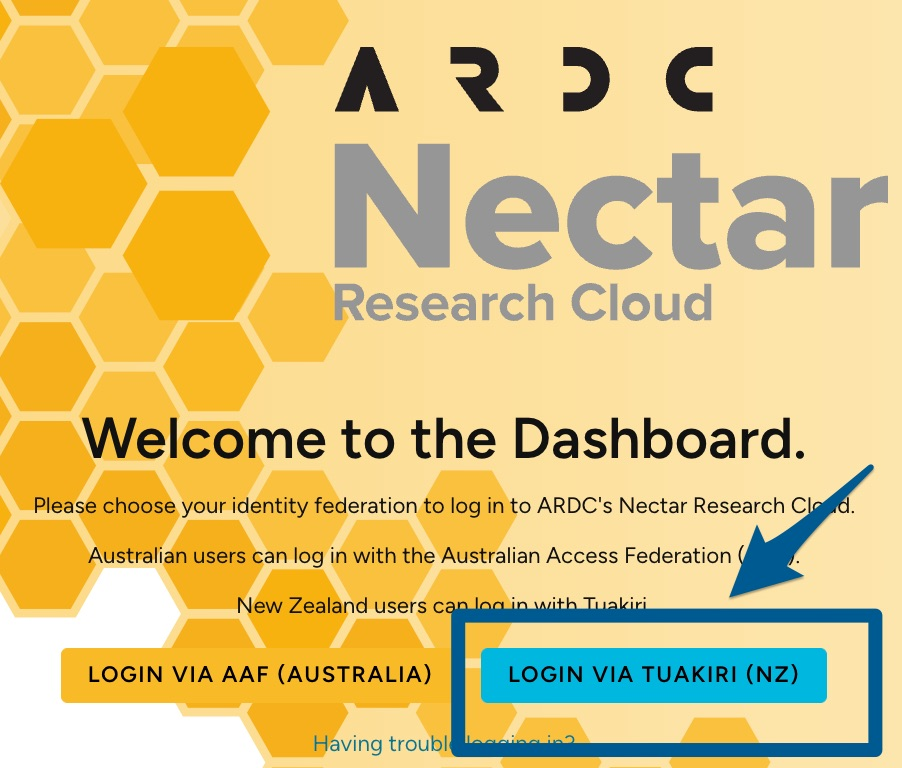

# Nectar

The [Nectar Research Cloud](https://dashboard.rc.nectar.org.au/auth/login/?next=/project/) is an excellent resource for researchers to get access to a wide range of computational resources.

More details and a link to access it can be found on the [Research Hub](https://research-hub.auckland.ac.nz/research-software-and-computing/advanced-compute/nectar-research-cloud). 

One common challenge is not to select the correct button for New Zealand.
{:width="50%"}

- mostly refer people to the (wonderful) documentation on the Nectar pages
- what is lacking:
  - how to install Windows
  - discuss a bit what Win10 vs. Server 2016 have for advantages/drawbacks
  - how the Service Units are calculated. Give one example. 

