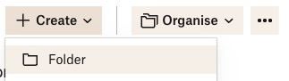
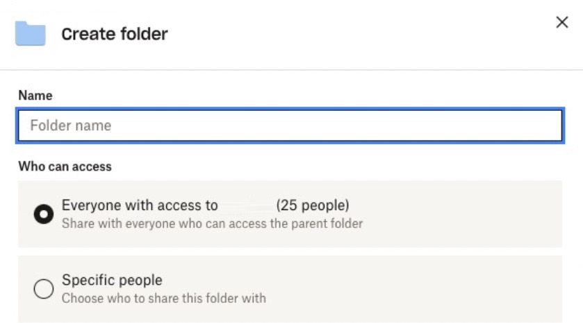
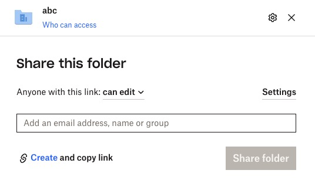
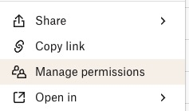

## Prerequisites

- You need to have access to an Institutional Dropbox License. More info, including the request, can be found [here](https://research-hub.auckland.ac.nz/guide-to-managing-research-data/research-data-management-or-storage-compute-and-analysis/dropbox-for-researchers). 
- You need to be aware of the [data sensitivity](https://research-hub.auckland.ac.nz/guide-to-managing-research-data/ethics-integrity-and-compliance/research-data-classification)
- While Dropbox offers clients for many operating systems (i.e., small pieces of software to be installed on your device), this guide focuses on the web interface 
  - in other words: You should use your browser and go to [Dropbox.com](https://dropbox.com) to follow the steps.

!!! bug
        check ATO for Dropbox by CISO

## Accessing Dropbox through the Browser

Use your preferred browser and go to [Dropbox.com](https://dropbox.com).

- Click the ++"Log in"++ button. 
- Do not use the Google or other Sign-In options, **make sure to use email** 
- Use your `@auckland.ac.nz` email address (you are likely to be redirected to the institutional login page)
  - In case you have already used this email account, please reach out to the CeR.

(Advanced): You can also access your **personal** Dropbox account and link it to your **institutional** account but this exceeds the scope of this guide.

## Sharing a sub-folder

- in the process of requesting a Dropbox license, you have been asked to provide a name for your top-level folder. This is the folder that you see when you log in to Dropbox. For this example, we assume that you have named it `MyResearchProject`.
- Navigate to the `MyResearchProject` folder 
- Click on `Create` and then `Folder`
  - 
- You will be asked if this shall be automatically shared with all others that have full access (in other words, also an Institutional Dropbox license and were added in the original or a follow-up request posted to the CeR)
  - 
- After this folder has been created and you are automatically redirected to it (or you have manually navigated to it), you can share it with others
  

!!! warning
        it is of utmost importance that you **share the sub-folder** and not the top-level folder.

## Users you shared the folder with

Once you have completed the previous steps, each user that you have shared the folder with will receive an email notification.
You can also check the list of users that you have shared the folder with by right-clicking the folder that you want to inspect and selecting 'Manager Permissions'.

External collaborators can upload files (imagine an overseas collaborator wanting to share a large dataset with you) and still stay within the storage limits of your institutional license -  which is currently unlimited.