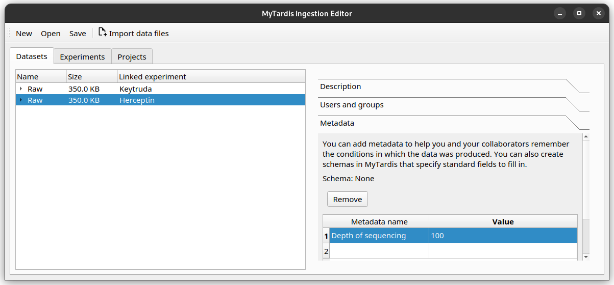
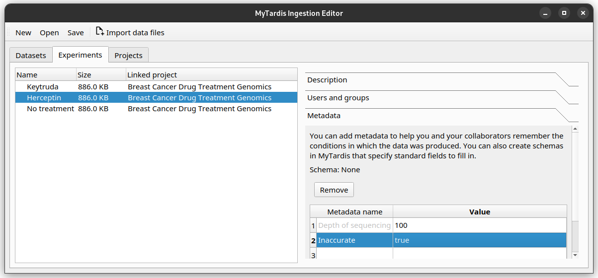

# Annotate your data with metadata

Now that your files are imported and organised, you can start annotating them. This step is vital to make the most use of the {{ service_name }}.

## Basic metadata fields

In {{ service_name }}, there is a basic set of metadata fields applicable for any Projects, Experiments, Datasets or Datafiles. They are fields like `name`, `ID`, `author` and `institution`.

## Additional metadata with Schemas

In addition, you can attach more metadata to a Project, Experiment, Dataset or Datafile through `Schemas`. They are made up of custom metadata fields called `Parameters`. You can specify the `Parameter` name and the value data type (for example, you can restrict the value to be a number, a string of characters, or a date.) 

`Schemas` need to be defined in {{ service_name }} before you can use them in Instrument Data Wizard. 

A Project, Experiment, Dataset or Datafile can have **multiple** `Schemas` associated with them.

!!! question "What can I store in Schemas?"

    You can associate domain- or instrument-specific metadata with a Project, Experiment, Dataset or Datafile using `Schemas`. One way to use `Schema` could be to describe the study or treatment you have applied to the sample. Alternatively, you may wish to note down the instrument configuration used for acquiring data. For example, data from a sequencer may benefit from a `Schema` with depth of sequencing and sequencing method as `Parameters`.
    
    It's best to create a data dictionary document with your collaborators to specify what metadata should be stored. See [data dictionary](../03-data-dictionary.md). 
    
    As part of onboarding, {{ service_name }} can support you in creating a data dictionary, and create any `Schemas` for your research group. Contact {{ service_contact }} for more information.

In the Instrument Data Wizard, first select the *Project*, *Experiment*, *Dataset* or *Datafile* you wish to edit, then you can change metadata on the right-hand pane.

The `Description` tab contains the basic metadata fields, while the `Metadata` tab contains the `Schema` metadata fields.

At the moment, the Instrument Data Wizard accepts free-text `Parameter` names and values.

## Recording Sarah's metadata

As Sarah, you have two things you need to include in the metadata. You need to note down the instrument the sequencing was done on, and the sequence depth used. In genetics, sequence depth measures the [completeness of the sequencing process](https://en.wikipedia.org/wiki/Coverage_(genetics)).

### Adding the instrument ID

To record the instrument, you first need to find the instrument's [persistent identifier (PID)](https://datascience.codata.org/articles/10.5334/dsj-2020-018). For Sarah, the sequencing company has given her the ID `http://hdl.handle.net/21.T11998/0000-001A-3904-0`.

!!! question "Where can I find my instrument's persistent identifier?"
    
    You can log in to the {{ service_name }} web portal to find the ID. See [here](../../04-finding-instrument-id/).

Instrument is a basic metadata field, so you can find it in the `Description` tab, as the `Instrument ID` field.

After filling out the field, the editor should look like this.

### Adding the sequence depth

You have decided with your team that sequence depth should be recorded as a `Schema Parameter` on each `Experiment`, with the name `Depth of sequencing`, and value as an integer.

Try adding 100 as the sequence depth for the Herceptin `Experiment`. Once finished, your editor should look like this.

If you need to delete a `Parameter` row, select that row, then click the `Remove` button.

!!! info "Keep your `Schema` names and values consistent"
    
    Record `Parameter` names and values consistently, using the same letter casing and units. This will help with finding your data in the future. For example, if you have a `Parameter` representing a length, decide on the name (e.g. "distance", no uppercase) and the value unit (e.g. millimetre), and use them consistently.

## Exercise: Adding more metadata

1. `Lead Researcher` is another basic metadata field on `Projects`. Try adding yourself as the lead researcher in the `Project`, using Sarah's University username `skau921`.

    Your editor should look like this:

    

2. For the Herceptin experiment, there was an error in the sequencing process. You would like to mark it as inaccurate. Decide on how you would represent this, then annotate the experiment.

    This is one way you may like to add this:

    