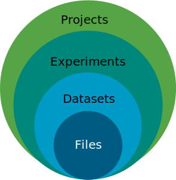
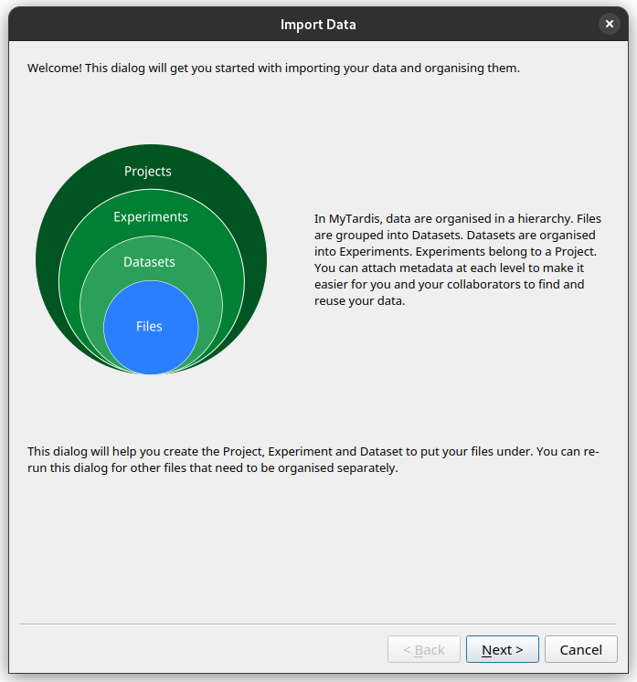
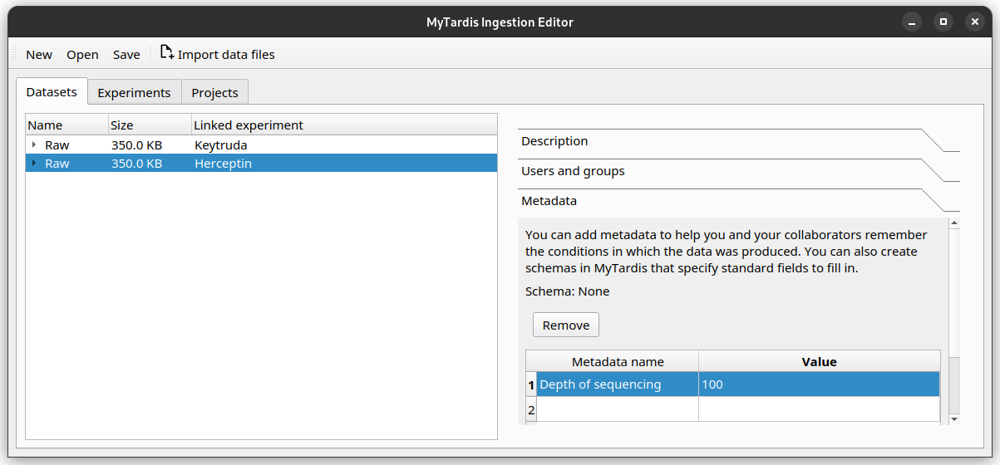

## Annotating your first dataset¶ { duration="2:00" }

Welcome! This tutorial will help you annotate a dataset using the
Instrument Data Wizard, in preparation for ingestion into {{ service_name }}.

!!! example
    This tutorial will follow a fictional scenario. You are Sarah :material-account-box:, a PhD
    student collecting data for your cancer genomics research, and you would
    like to store that data in your University's instrument data
    repository.


!!! info "What is the Instrument Data Wizard?"

    If you're not familiar with what {{ service_name }} and Instrument Data
    Wizard do, and how they work together, check out [this](../03-data-dictionary.md) first.


By the end of this tutorial, you will learn about the Instrument Data
Wizard and {{ service_name }}, and how to:

-   decide on a structure for your data for {{ service_name }}.
-   import data files into the Instrument Data Wizard and add structure
    to it.
-   annotate your data with metadata
-   restrict access to your data or subset of the data
-   export the metadata

**If you want to follow along on your computer**, please install
Instrument Data Wizard, download the tutorial data, and unzip it on your
desktop. This data will be used in the rest of the tutorial.


[:material-folder-download: Download the tutorial-data.zip file here](../../assets/tutorial-data.zip)


Contact {{ service_contact }} if you need assistance getting set up on
{{ service_name }}.

Ready? Let's begin!


## Decide how to describe and structure your data


Before we start using the Instrument Data Wizard, it's good to plan out and document **how your data will be structured** for {{ service_name }}, so you and your collaborators (and your future self!) will easily be able to find and use your data in the {{ service_name }} web portal.

### How {{ service_name }} structures data

At its heart, {{ service_name }} is a database. Data are organised in a hierarchical structure, like folders and subfolders. There are three levels. You need to decide how to structure your data to fit in with this hierarchy.

{width=300px}


* Data files are grouped into *Datasets*.
* *Datasets* are organised into *Experiments*.
* *Experiments* belong to a *Project*.

A *Dataset* may belong to multiple *Experiments*, and an *Experiment* may belong to multiple *Projects*.

At each level of the hierarchy and at the individual file level, there are mandatory metadata fields that you can use to describe your data. There is also the ability to associate a custom metadata schema at each level, which allows you to record any relevant domain-specific observations and variables. The {{ service_name }} Search functionality allows you to filter for data based on metadata.

### Things to consider

Here are some things to consider when deciding how your data should fit into this hierarchy:

{height=300px}

* Usually, there should be one *Project* that corresponds to the research project or unit of research activity that you are collecting data for.
* Use *Experiments* to represent a study sample or variable you are studying. Store properties about the sample as metadata in each *Experiment*.
* Create one *Dataset* for each instrument you are using for acquiring data. Use the *Dataset* to contain all data files from that instrument for the *Experiment*. Store instrument run conditions as metadata in each *Dataset*.
* If the data is already using a directory structure, consider how that could translate into the hierarchical groupings.
* Consider whether you need to restrict access for a subset of your data. If so, you can group them as separate *Experiments* or *Datasets*. Later, you can restrict access to them as a whole group.

### Sarah's sequencing data


As Sarah, you are studying how breast cancer cells respond to different drug treatments. You work closely within a group of three other PhD students led by Dr Charlotte Henare.

To collect data, you take samples of cancer cells from an anonymous donor from the Hospital, treating the samples with drugs, and sending them off to a sequencing company for processing.

You sent off 15 cell samples (5 for each group) six weeks ago that have:

1. no treatment,
2. treatment with the drug Herceptin, and
3. treatment with the drug Keytruda.

The tutorial data you downloaded are the resulting files sent through a USB stick via courier. The data contains the raw `*.fastq` files as well as aligned `*.bam` files (data processed by a bioinformatician) for each kind of treatment. 

!!! example
    You are now responsible for organising, setting up access control and adding metadata to the data, before it is ingested into the University's online instrument data repository {{ service_name }} . You and your group members can then access the data through the repository portal and use it in analysis.

Because the raw data is sensitive and could lead to the identification of patients, any raw data should only be accessible to yourself. Other data can be accessed by the whole group (with the group ID `eres004011-admin`)


After a discussion with your collaborators, you have created this data structure plan.

#### Sample data structure plan

 - **Project** - The Project is called “Breast Cancer Drug Treatment Genomics” project, with the ID “BREAST04”.
 - **Experiments** - One experiment for each treatment type (i.e. “No treatment” with ID “NoTreatment”, “Herceptin” with ID “Herceptin”, Keytruda with ID “Keytruda”).
 - **Datasets** - In each Experiment, there would be two *Datasets*: one for raw `.fastq` files named “Raw” with ID “[Treatment ID]-Raw”, and another for aligned `.bam` files named “Aligned” with ID “[Treatment ID]-Aligned”.
 - **Datafiles** - Under each Dataset, there would be five files, one file from each tissue sample.
 - Clinical details and sequencing instrument configurations will be recorded as metadata at the Dataset level.

``` 
Project: “Breast Cancer Drug Treatment Genomics” - ID “BREAST04”/
├─ Experiments: (One experiment per treatment)/
│  ├─ “No treatment” with ID “NoTreatment”/
│  │  ├─ Datasets/
│  │  │  ├─ RAW (for raw .fastq files) with ID “[Treatment ID]-Raw"/
│  │  │  │  ├─ File 1
│  │  │  │  ├─ File 2
│  │  │  │  ├─ File 3
│  │  │  │  ├─ File 4
│  │  │  │  ├─ File 5
│  │  │  ├─ Aligned for aligned .bam files with ID “[Treatment ID]-Aligned”
│  │  │  │  ├─ File 1
│  │  │  │  ├─ ...
│  ├─ "Keytruda" (with ID “Keytruda”)/
│  │  ├─ Datasets/
│  │  │  ├─ RAW (for raw .fastq files) with ID “[Treatment ID]-Raw"/
│  │  │  │  ├─ File 1
│  │  │  │  ├─ ...
│  │  │  ├─ Aligned for aligned .bam files with ID “[Treatment ID]-Aligned”
│  │  │  │  ├─ File 1
│  │  │  │  ├─ ...
│  ├─ “Herceptin” with ID “Herceptin”/
│  │  ├─ Datasets/
│  │  │  ├─ RAW (for raw .fastq files) with ID “[Treatment ID]-Raw"/
│  │  │  │  ├─ File 1
│  │  │  │  ├─ ...
│  │  │  ├─ Aligned for aligned .bam files with ID “[Treatment ID]-Aligned”
│  │  │  │  ├─ File 1
│  │  │  │  ├─ ...

(Clinical details and sequencing instrument configuration)
```

!!! example "Exercise: How does your own data fit into this hierarchy?"
    Think about the data you would like to ingest into {{ service_name }} and discuss it with your collaborators. Plan out how you would structure the data. Ask for a consultation with the friendly {{ service_name }} staff if you would like some help!

## Import your data into the Instrument Data Wizard

To import your data into the Instrument Data Wizard, open the Wizard and click the `Import data files` button.


A step-by-step wizard will show up, with the first page giving a brief introduction to the {{ service_name }} hierarchy.



### Add the first Project, Experiment, Dataset and Datafiles

Click *Next*. In the subsequent dialogs, the wizard will ask you where you would like to organise your data. Because we are starting with a blank metadata file, the wizard will ask you to create a new Project, Experiment and Dataset. 

As Sarah, you would like to import your raw data for the Keytruda trial. See if you can re-create this hierarchy in the Instrument Data Wizard:

| Level      | Cell                                                                               | Input text                             |
|------------|------------------------------------------------------------------------------------|----------------------------------------|
| Project    | Proiect name                                                                       | Breast Cancer Drug Treatment Genomics  |
|            | Proiect identifier                                                                 | BREAST04                               |
|            | Principal Investigator                                                             | UPI123                                 |
|            | Description                                                                        | My nice description of the project.    |
| Experiment | Experiment name                                                                    | Keytruda                               |
|            | Experiment identifier                                                              | Keytruda                               |
|            | Description                                                                        | My nice description of the experiment. |
| Dataset    | Dataset name                                                                       | Raw                                    |
|            | Dataset identifier                                                                 | Keytruda-Raw                           |
|            | Instrument identifier                                                              | BiruVSlide1                            |
| Datafiles  | all .fastq files `tutorial-data/keytruda/`.                                        |

The instrument ID (the persistent identifier, `PIDINST`) will be provided by the Facility Manager.


Once finished, your editor should look like this.


!!! note "What if I want to add data into an existing `Project` in the repository?"

    If there is already a Project for your data in the data repository, you need to import it into the Instrument Data Wizard before you can start adding files to it. You can follow the instructions for [Adding data to existing Projects, Experiments or Datasets](../02-adding-to-existing-structure.md).


### Add more data


What if you have files you need to organise separately from the initial import? Or if you need to add more files into the same dataset? For example, you may wish to ingest more than one sample or instrument run data files.

You can click the `Import data files` button again, and the step-by-step wizard will prompt you to add files and ask how you would like to organise them.


You can also right-click on the `Project`, `Experiment` or `Dataset` you would like to add more data to, and select the `Add Experiment`, `Add Dataset` or `Add files` options.

As Sarah, you also have some raw data in the Herceptin trial you would like to import. 

After clicking the `Import data files` button and going through the initial explanation screen, you will now be presented with a choice to add files to an existing `Project`, or create a new `Project`. 


Since this is data for the same project, choose the "Breast Cancer Drug Treatment Genomics" `Project`.

Then proceed through the rest of the wizard using this setup.

* Create a new Experiment with name "Herceptin", and ID "Herceptin".
* Create a new Dataset with the name "Raw", and ID "Herceptin-Raw".
*  Data files: Add the `.fastq` files in the tutorial data folder, under `tutorial/herceptin/`.
Once finished, your editor should look like this.


### Save your progress

Instrument Data Wizard keeps all your data structure and annotations in an YAML-formatted ingestion file. This file is read by the {{ service_name }} ingestion process to find all your data files. It needs to be saved in the root folder of your data.

Click the ++"Save"++ button, and save your ingestion file under the tutorial data folder. Name it `ingestion.yaml`. 

!!! note
    
    Remember to save your changes as you work! As the Instrument Data Wizard is still being developed, bugs and crashes may happen at inopportune moments. After a crash, you can reopen the file using the `Open` button.


### Exercise: Add even more data


Try to re-create the hierarchy in the Instrument Data Wizard as described in the :ref:`example data structure plan <sample-data-structure-plan>`.

Once finished, your editor should look like this.


## Annotate your data with metadata

Now that your files are imported and organised, you can start annotating them. This step is vital to make the most use of the {{ service_name }}.

### Basic metadata fields

In {{ service_name }}, there is a basic set of metadata fields applicable for any Projects, Experiments, Datasets or Datafiles. They are fields like `name`, `ID`, `author` and `institution`.

### Additional metadata with Schemas

In addition, you can attach more metadata to a Project, Experiment, Dataset or Datafile through `Schemas`. They are made up of custom metadata fields called `Parameters`. You can specify the `Parameter` name and the value data type (for example, you can restrict the value to be a number, a string of characters, or a date.) 

`Schemas` need to be defined in {{ service_name }} before you can use them in Instrument Data Wizard. 

A Project, Experiment, Dataset or Datafile can have **multiple** `Schemas` associated with them.

!!! question "What can I store in Schemas?"

    You can associate domain- or instrument-specific metadata with a Project, Experiment, Dataset or Datafile using `Schemas`. One way to use `Schema` could be to describe the study or treatment you have applied to the sample. Alternatively, you may wish to note down the instrument configuration used for acquiring data. For example, data from a sequencer may benefit from a `Schema` with depth of sequencing and sequencing method as `Parameters`.
    
    It's best to create a data dictionary document with your collaborators to specify what metadata should be stored. See [data dictionary](../03-data-dictionary.md). 
    
    As part of onboarding, {{ service_name }} can support you in creating a data dictionary, and create any `Schemas` for your research group. Contact {{ service_contact }} for more information.

In the Instrument Data Wizard, first select the *Project*, *Experiment*, *Dataset* or *Datafile* you wish to edit, then you can change metadata on the right-hand pane.


The `Description` tab contains the basic metadata fields, while the `Metadata` tab contains the `Schema` metadata fields.

At the moment, the Instrument Data Wizard accepts free-text `Parameter` names and values.

### Recording Sarah's metadata

As Sarah, you have two things you need to include in the metadata. You need to note down the instrument the sequencing was done on, and the sequence depth used. In genetics, sequence depth measures the [completeness of the sequencing process](https://en.wikipedia.org/wiki/Coverage_(genetics)).

#### Adding the instrument ID

To record the instrument, you first need to find the instrument's [persistent identifier (PID)](https://datascience.codata.org/articles/10.5334/dsj-2020-018). For Sarah, the sequencing company has given her the ID `http://hdl.handle.net/21.T11998/0000-001A-3904-0`.

!!! question "Where can I find my instrument's persistent identifier?"
    
    You can log in to the {{ service_name }} web portal to find the ID. See [here](../04-finding-instrument-id.md).

Instrument is a basic metadata field, so you can find it in the `Description` tab, as the `Instrument ID` field.

After filling out the field, the editor should look like this.


#### Adding the sequence depth

You have decided with your team that sequence depth should be recorded as a `Schema Parameter` on each `Experiment`, with the name `Depth of sequencing`, and value as an integer.

Try adding 100 as the sequence depth for the Herceptin `Experiment`. Once finished, your editor should look like this.



If you need to delete a `Parameter` row, select that row, then click the `Remove` button.

!!! info "Keep your `Schema` names and values consistent"
    
    Record `Parameter` names and values consistently, using the same letter casing and units. This will help with finding your data in the future. For example, if you have a `Parameter` representing a length, decide on the name (e.g. "distance", no uppercase) and the value unit (e.g. millimetre), and use them consistently.

### Exercise: Adding more metadata

1. `Lead Researcher` is another basic metadata field on `Projects`. Try adding yourself as the lead researcher in the `Project`, using Sarah's University username `skau921`.

    Your editor should look like this:

    

2. For the Herceptin experiment, there was an error in the sequencing process. You would like to mark it as inaccurate. Decide on how you would represent this, then annotate the experiment.

    This is one way you may like to add this:

    
    

## Restrict access to your data

In the Instrument Data Wizard, you can define which users or groups of users have access to your data in the {{ service_name }}. 

{{ service_name }} has a cascading access control mechanism which allows you to apply restrictions on which users or groups of users can access a file or a group of files. Permissions granted at a higher level of the hierarchy will cascade down to all the files nested in it unless explicitly overridden.

Users must have an account created in {{ service_name }} in order to access the data.

!!! example "Adding Restrictions on your own data"
        Think about who needs to be able to access your data. What kind of access should they have? If there's a subset of the data that should be accessible to more or fewer people, how should they be organised?

## Save the ingestion file

Once you are finished organising and annotating your data, you can save
the ingestion file for the last time. Ensure to save the ingestion file
in the root of your data folder.

Your data folder should look like this.


We are finished! When your data is copied and ingested into
{{ service_name }} , the ingestion file will be examined for a list of data
files, how they should be structured, metadata associated with them, and
access control properties. If there are any errors or validation
problems in the process, you will be notified.

This is the end of this introductory tutorial. Please contact
{{ service_contact }} for any further questions.
