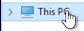
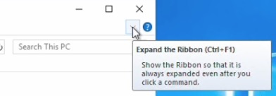
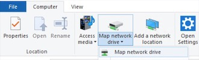
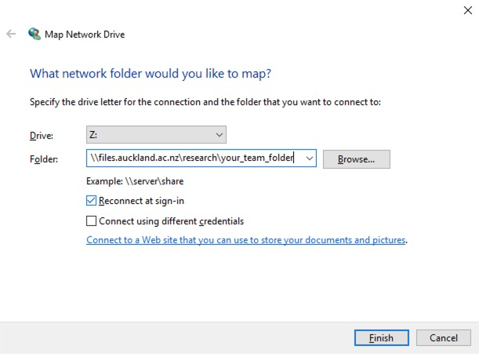
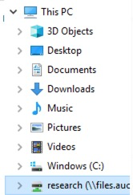
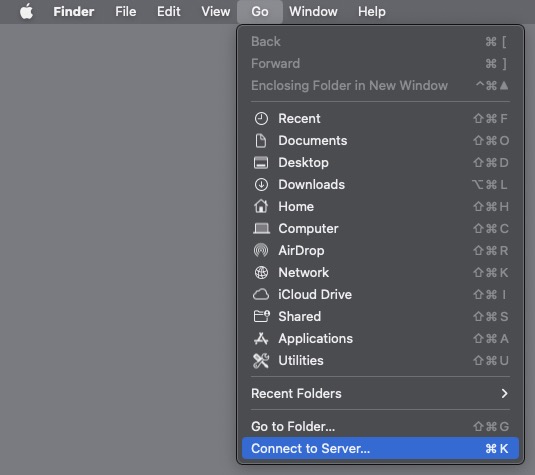
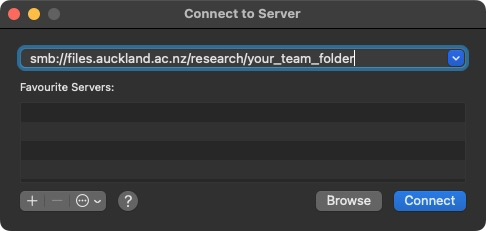
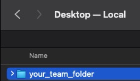
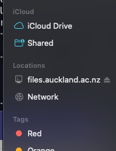

## Background { duration="2:00" }

This guide will help you to access/mount/map your Research Drive on your computer. 
It is assumed that you have already requested a Research Drive and that it has been allocated to you. If you have not yet requested a Research Drive, please see the [Research Hub](https://research-hub.auckland.ac.nz/research-data/research-storage/) for more information.

Depending on the operating system you use (i.e., Windows(:material-microsoft-windows:)/Linux(:fontawesome-brands-linux:)/MacOS(:material-apple:)), the steps to access your Research Drive will be **slightly different**.


!!! info

    we have to decide if we want 
    - tabs 
    - expandable boxes
    - 3 different pages (3x Codelab)


=== "Windows :material-microsoft-windows:"

    - Open your Windows Explorer (++win+e++) 
    - Navigate to 'This PC' 
      - 
    - Make sure your 'View' is set to 'Details' (or use the keyboard shortcut ++ctrl+f1++ ) 
    - Click on 'Map Network Drive'
        -  
    - For the `Drive` letter, choose a letter that is not already in use (e.g., `R:\``)
    - For the `Folder` please enter your Research Drive location (e.g., `\\files.auckland.ac.nz\research\**your_team_folder**`)
        - please pay close attention to the backslashes (`\\`) and make sure not to use forward slashes (`/`) in the path for Windows
        - tick :octicons-checkbox-16: the option 'Reconnect at sign-in'
        - click on `Finish`
        - 
    - When you’re done, you should see the new drive letter under `This PC` and will be able to access its contents like you would any other folder. If you want to disconnect the network drive, right-click on it and select `Disconnect`.
      - 


=== "Linux :fontawesome-brands-linux:" 


    You need to have sudo privileges to mount network drives.  
    Prerequisites `cifs-utils` and create a mount directory [required once]

    On Ubuntu VM, run:

    ```bash
    sudo apt-get update
    sudo apt-get install cifs-utils
    ```
    On Red Hat VM, run:

    ```bash
    sudo yum update
    sudo yum install cifs-utils
    ```

    Below is a script you can use to mount a research drive.

    Make sure you adjust the name of your drive in the variable `drive_name` at the beginning of the script to your needs.

    ```bash
    drive_name="rescer201800002-cer-researchfolder-test"
    share="//files.auckland.ac.nz/research/${drive_name}"

    # unifiles doesn't work with smb versions earlier than 2.1, and smb version 2.1 has some issues with caja file manager
    # we therefore specify smb version 3.0, introduced with Windows 8 / Windows Server 2012
    smb_version="3.0"

    mountpoint="${HOME}/${drive_name}"
    common_options="iocharset=utf8,workgroup=uoa,uid=${USER},dir_mode=0700,file_mode=0700,nodev,nosuid,vers=${smb_version}"
    options="username=${USER},${common_options}"

    mkdir -p ${mountpoint}
    sudo mount -t cifs "${share}" "${mountpoint}" -o "${options}"
    if [ "$?" -gt "0" ]; then
      rmdir ${mountpoint}
    fi
    ```

    If you save this code in the file `~/mount_drive.sh` and give it executable permissions via `chmod u+x ~/mount_drive.sh`, you can then run the script like this:
    
    ```bash
    ~/mount_drive.sh
    ```

    To unmount a network drive:

    ```bash
    sudo umount -l ${HOME}/rescer201800002-cer-researchfolder-test
    ```

    Make sure you adjust `${HOME}/rescer201800002-cer-researchfolder-test` to the location you used when you mounted the research drive

=== "MacOS :material-apple:"

    - Open the `Finder` 
    - click on `Go` on the top menu bar and `Connect to Server` or use the shortcut ++cmd+k++ 
    - Enter your Research Drive location (e.g., `smb://files.auckland.ac.nz/research/your_team_folder`)
      - Make sure that you use forward slashes (`/`) and not backslashes (`\\`) 
    - Click `+` to add the server address to the Favourite Servers section for later use.
    - Enter your user name (UPI) and password and click ++"Connect"++ 
    - When you connect to the network drive a shortcut can be found on the Desktop 
    - In the `Finder` side menu, you can also see the network drive under `Locations`


 