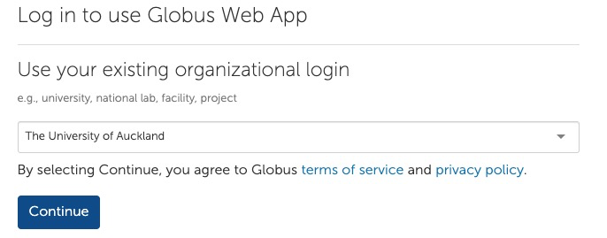

## Getting started { duration="2:00" }

## Codelab how to use Globus

- log in to the website
- authentication
- what the two windows mean
- what an endpoint means
- iterate how GPC vs. Globus works
- how to share data

### One-time Setup

Request a Globus account from the [Research Hub](https://research-hub.auckland.ac.nz/research-software-and-computing/advanced-compute/data-transfer-service)

Go to the website

### Globus Connect Personal

Globus Connect Personal is a piece of software that you can install on your computer to make it a Globus Endpoint. This means that you can transfer data to and from your computer using Globus.

An overview per system is provided [here](https://docs.globus.org/globus-connect-personal/#install), details follow below.

#### Windows

- download the installer from [here](https://www.globus.org/app/endpoints/create-gcp)

#### Linux

- often best to use the non-gui version
- maybe link to the scripts that Martin F and Jens have written
- user accounts on Nectar

#### Mac

### Understanding the interface

Overall, Globus file transfers can be understood as two Windows Explorer or Mac Finder or other File Navigator windows that are put side by side. One window shows the files on the source endpoint, the other window shows the files on the destination endpoint.

It doesn't matter what is placed to the left or right side, still it might make it easier for you to have the source (where you want to get data from on the left) and the destination (where you want to deposit data) on the right side.

### Logging in to various endpoints

#### DTN and NeSI
For this example, we assume that we have a file on our Research Drive (link to how to get that mounted) that we want to transfer to NeSI.
This is quite common for the start of a research project data analysis stage.
Then we process files on the NeSI HPC.
Then we want to transfer the analysis results back to the Research Drive.

#### DTN and GCP
For this example, we assume that we want to receive some research data from a collaborator who is not part of an organisation that has access to a DTN (LINK TO THE THEORY BIT)