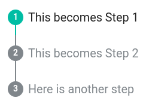

## Getting started { duration="2:00" }

### One-time Setup

1. Clone this repo
2. cd into newly cloned repo
3. `pip install -r requirements.txt`
4. Run `./update.sh` (:material-apple: :fontawesome-brands-linux:) or `.\update.ps1` (:material-microsoft-windows:)

### Mkdocs Requirements

In **mkdocs.yml**, have the required properties:

```yaml
theme:
  name: material
  custom_dir: codelab

markdown_extensions:
  - attr_list
  - pymdownx.superfences
```

Create a bare minimum **docs/\*.md** codelab page:

```markdown
---
codelab: true
---

# My Lab's Title

## This becomes Step 1

Hello world instructions for Task 1

## This becomes Step 2

Blah blah for Task 2

```

By default, the codelab considers the H2 heading as a new step. Content under a `##` (Heading 2) until the next H2 is considered a step.

## YAML frontmatter

Explicitly set a title, author, report link and date. The date can also be rendered with [git revision date](https://squidfunk.github.io/mkdocs-material/setup/adding-a-git-repository/#revision-date).

```markdown
---
title: Example Workshop
author: "Anonymous Penguin"
revision_date: 2022-01-10
report_bugs: http://endless.horse/
codelab: true
description: |
  This section takes **markdown.** It's part of the introductory header.

  Hello! Lorem Ipsum
---

## This becomes Step 1

Hello world

## This becomes Step 2

Blah blah
```

There is an optional `description` field which lets you put an introduction at the top of a codelab.

### Hide tabs

If the [tabs feature](https://squidfunk.github.io/mkdocs-material/setup/setting-up-navigation/#navigation-tabs) enabled, you can hide tabs on a particular page:

```
---
hide:
  - tabs
---
```

## Mkdocs Configuration

In **mkdocs.yml**:

```yaml
theme:
  name: material # Mkdocs Material is the base theme
  custom_dir: codelab # folder to overrides, in this case 'codelab'
  report_bugs: to:an@email.com # url for the Bug Report button
  global: true # default false

plugins:
  - search
  - codelab:
      auto_number: true # Whether to auto-number sections
      delimiter: 'h2'
```

|Property|Description|
|--------|-----------|
|global | If enabled, then all pages will have the codelab theme, unless `codelab: false` frontmatter property is specified. By default this option is `false`. |
| report_bugs | Set the default URL for **Report a Mistake.** |
| auto_number | Headings will automatically be numbered, and wrong numbers will be corrected according to their logical order.
| delimiter |  A [CSS selector](https://www.w3schools.com/cssref/css_selectors.asp) to segregate steps in the stepper. By default \<h2\>, or in markdown, the double pound `## Heading` is the delimiter.


### Global

Exclude a page from the Codelab Theme by setting `codelab` to `false` in the page's frontmatter:

```
---
title: This page isn't a lab
codelab: false
report_bugs: 'www.example.com' # this will override the link set in the config file
---

Hello everyone...
```

### Set a custom delimiter { duration=6:00 }

Make sure to include the `attr_list` Markdown extension.

```yaml
markdown_extensions:
  - attr_list

plugins:
  - search
  - codelab:
      delimieter: '[step]'
```

Then in a markdown page, assign attributes to a heading.

```markdown
---
codelab: true
author: Anonymous Penguin
---

# My Lab's Title

## This becomes Step 1 { step }

Hello world

## This becomes Step 2 { step }

Blah blah

# This doesn't count

Using more than one H1 is not recommended, but the plugin can handle it.

## This doesn't count

Just in case

## Here is another step { step=3 }

This will be step 3

```

Only the headings marked with `{ step }` will become steps in the tracker:



Additional examples:

=== "Class"

    ```yaml
    plugins:
      - codelab:
          delimiter: '.my-class'
    ```

    ```markdown
    ---
    codelab: true
    author: Anonymous Penguin
    title: My Lab
    ---

    ## This becomes Step 1 { .my-class }

    Hello world

    ### This becomes Step 2 { .my-class }

    1. Text and list items won't count as a heading or a step.
      { .my-class }
    2. Substep
    3. Substep

    ```

=== "Heading Level and Class"

    ```yaml
    plugins:
      - codelab:
          delimiter: 'h2.my-class'
    ```

    ```markdown
    ---
    codelab: true
    author: Anonymous Penguin
    title: My Lab
    ---

    ## This becomes Step 1 { .my-class }

    Hello world

    ## This becomes Step 2 { .my-class }

    Blah blah

    ### H3 won't be a step { .my-class }

    ```


=== "Attribute"

    ```yaml
    plugins:
      - codelab:
          delimiter: '[duration]'
    ```

    ```markdown
    ---
    codelab: true
    author: Anonymous Penguin
    title: My Lab
    ---

    ## This becomes Step 1 { duration=1:00 }

    Hello world

    ## This becomes Step 2 { duration=5:00:00 }

    Blah blah

    # This becomes Step 3 { duration=6:00 }

    Using more than one H1 is not recommended, but the plugin can handle it.

    ```

=== "Multiple Delimeters"


    ```yaml
    plugins:
      - codelab:
          delimiter: 'h2, [step], [duration]'
    ```

    ```markdown
    ---
    codelab: true
    author: Anonymous Penguin
    title: My Lab
    ---

    ## This becomes a step

    Hello world

    ### This becomes a step { step }

    Hello world

    ### This becomes a step { duration=6:00 }

    Hello world

    ```

## Duration calculated { step duration=2:00 } 

Optional: set the duration attribute for steps to calculate the estimated time.

```markdown

## Wash the dishes { duration="10:00" }

Etc...

```

You can set durations for list items and paragraphs, too.

```markdown

## Wash the dishes

1. Grab a towel.
    { duration=1:00 }
2. Run it around the rim.
    {duration=1:00 }

Optional: Grab Barkeeper's Friend and some gloves for powerwashing tea stains.
{ duration=5:00 }

```

Note that all durations will be added together, so the step duration is not needed.

## Finishing touches { step duration="2:00" }

### Printing

The theme is configured to have a print version. Press ++ctrl+p++ to take a look.

### References

- [Google](https://www.google.com)
- [Google](https://www.google.com)
- [Google](https://www.google.com)