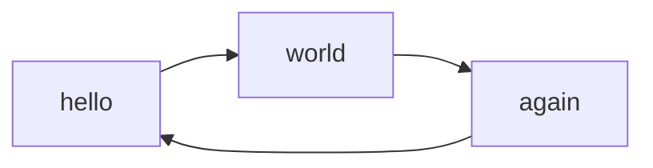

# to consider

- how do I link to the same md file several times?
  - embed?
  - do I have to put the mkdocs nav thing? If so: How much manual effort does that require? Isn't there a plugin/automation


HOW DO the creators (materials), do it for their documentation. I like the broad topics on the left, the details of each md on the right
https://github.com/squidfunk/mkdocs-material/blob/master/mkdocs.yml#L39
https://squidfunk.github.io/mkdocs-material/reference/
https://squidfunk.github.io/mkdocs-material/customization/#extending-the-theme

- [multiple docs sub-folders](https://github.com/backstage/mkdocs-monorepo-plugin) being automatically collated into one repo
- [language switcher planned misuse for win/osx/linux?](https://squidfunk.github.io/mkdocs-material/setup/changing-the-language/#site-language-selector)

# test 

this is to show some of the cool features of MKDocs

For a lot of how-to-guides, you need to let users know what keys to press.
There is the `<kbd>` tag, but by including `pymdownx.keys` we can make our lives easier:
Some examples, fenced by the `++` characters:

- ++ctrl+alt+delete++
- ++cmd+fn+delete++
- ++lbutton++
- ++mbutton++
- ++rbutton++

- ++arrow-up++
- ++arrow-down++
- ++arrow-left++
- ++arrow-right++
- ++page-up++
- ++page-down++
- ++home++
- ++end++
- ++tab++

## test graphs



## Code Annotation Examples

### Codeblocks

Some `code` goes here.

### Plain codeblock

A plain codeblock:

```
Some code here
def myfunction()
// some comment
```

#### Code for a specific language

Some more code with the `py` at the start:

``` py
import tensorflow as tf
def whatever()
```

#### With a title

``` py title="bubble_sort.py"
def bubble_sort(items):
    for i in range(len(items)):
        for j in range(len(items) - 1 - i):
            if items[j] > items[j + 1]:
                items[j], items[j + 1] = items[j + 1], items[j]
```

#### With line numbers

``` py linenums="1"
def bubble_sort(items):
    for i in range(len(items)):
        for j in range(len(items) - 1 - i):
            if items[j] > items[j + 1]:
                items[j], items[j + 1] = items[j + 1], items[j]
```

#### Highlighting lines

``` py hl_lines="2 3"
def bubble_sort(items):
    for i in range(len(items)):
        for j in range(len(items) - 1 - i):
            if items[j] > items[j + 1]:
                items[j], items[j + 1] = items[j + 1], items[j]
```

## Icons and Emojs

:smile: 

:fontawesome-regular-face-laugh-wink:

:fontawesome-brands-twitter:{ .twitter }

:octicons-heart-fill-24:{ .heart }


# Icons to use
- MKDocs comes with a lot of icons
- they are in the theme folder `.../venv/lib/python3.11/site-packages/material/templates/.icons/
- an efficient way to find the icon you want is to check [this website](https://pictogrammers.com/library/mdi/)
- to use them, you need to adapt the syntax a bit: 
  - for example: you would find
  - 
``` yaml hl_lines="3"
switch.my_switch:
friendly_name: My Switch
icon: mdi:account-arrow-down-outline
```
  - and you will use the following part of the last line: `account-arrow-down-outline`, this gets the prefix `material-` and is fenced by the `:` character before and after. So you write this code `:material-account-arrow-down-outline:`
  - to get this icon :material-account-arrow-down-outline:


