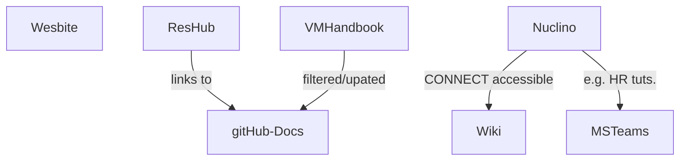

# Documentation Architecture


here i test using HTML

## The existing Documentation


| System                                   | Audience                 | Content Description                                      | Goal                                       |
| ---------------------------------------- | ------------------------ | -------------------------------------------------------- | ------------------------------------------ |
| (A) CeR Website                          | External-facing          | Mainly contains Service Description and Annual Report, Our People | Promotion|
| (B) Research Hub                        | Researcher-facing        | Mainly contains **abstract** Service Description            | Actionable (create a ticket, consultation, etc.) |
| (C) Nuclino                             | Internal-/staff-facing   | Mainly contains **how-to-guides **(for BAU and/or onboarding) |  phase out |
| (D) MSTeams/Sharepoint                  | Internal-/staff-facing   | Mainly contains **presentations**, HR instructions           | internal data sink |
| (E) VM-Handbook/CeRServides Handbook     | Internal-/staff-facing   | Mainly contains presentations, HR instructions           | replace with new solution |


## Design and Content Principles

Before we dive into the technical details, we need to define some principles that will guide our work:

- (Do not Repeat Yourself) **DRY** principle shall be followed as much as possible; cost-benefit trade-offs migh be necessary, in principle, changes in one place shall propagate everywhere else, ideally with no manual interaction
- we want to minimise the number or platforms/outlets
- **a consistent look and feel** shall be achieved
- ideally, design-aspects are inherited by several 'outlets'
  - **cer-documentation**: researcher-facing, mostly detailed how-to-guides, with a very clear target-audience
  	- **IDS-documentation**: Will be a sub-section? researcher-facing, mostly detailed how-to-guides, with a very clear target-audience
	- **IDS-reference**:  developer-facing, a docstring-based autogenerated reference material
- there should be an experienced user overview and then collapsible boxes for the details

??? tip "Example for a collapsible"

    Within this box, we provide more details that would bore/distract advanced users and might disrupt the overall narrative, if a novice needs this kind of detailed information, it is just one click away

### Some theory

Based on [Noel's link](https://documentation.divio.com/) and the resulting [Youtube talk](https://youtu.be/t4vKPhjcMZg), there are four types of documentation:

| Category          | Description                                           | Example                                            |
| ----------------- | ----------------------------------------------------- | -------------------------------------------------- |
| **Tutorials**     | Learning-Oriented with Practical Steps for Studying | e.g. "How to navigate Photoshop"                  |
| **How-to-guides**  | Problem-Oriented with Practical Steps for Working  | e.g. "How to achieve one certain goal"            |
| **Reference**     | Information-Oriented about theoretical knowledge     | e.g. "Glossary-style, ~~boring~~ documentation/VSC-help" |
| **Explanation**    | Understanding-Oriented about theoretical knowledge  | e.g. "Abstract discussion why the software is like this" |

Most of what we will do is 'how-to-guides'.

## Game Plan

-  Scan what documentation we have, remove/adjust/add if gap is identified
  - what do we have/want
  - who is responsible for
    - creating/updating content
    - approving
- Agree on a structure
  - what what is parent-child?
  - what terminology?

LINK TO THE EXCEL SHEET
- add one template for emails that needs to update and then be fed into the CLI `eres drive allocation notice   project_groups.json`



## Questions

- how to make design inheritable across GHRepos
- how to link md files several times (DRY principle) but not having to manually create a navigation?
  - maybe a blog
  - or [replace](https://github.com/SivagiriVisakan/mkdocs-replace-plugin)
- do we want to switch operating systems (similar to a langnage switcher)?
- where to include ToCs
- how to have collapsible boxes
- where to store video? Youtube vs. x
- where to store training material
  - DReSA (mostly Australia-focused)
  - Figshare (get DOI but have to revision a lot?)
  - Panopto (hard to link to, as part of Canvas/SSO?)
- how to get a broken link checker


# Why MKDocs Material is cool:

- [language switcher planned misuse for win/osx/linux?](https://squidfunk.github.io/mkdocs-material/setup/changing-the-language/#site-language-selector)


## we can get tabs

=== "C"

    ``` c
    #include <stdio.h>

    int main(void) {
      printf("Hello world!\n");
      return 0;
    }
    ```

=== "C++"

    ``` c++
    #include <iostream>

    int main(void) {
      std::cout << "Hello world!" << std::endl;
      return 0;
    }
    ```
## Admonitions aka Call-Outs

!!! note "This is my title of the note"

    Lorem ipsum dolor sit amet, consectetur adipiscing elit. Nulla et euismod
    nulla. Curabitur feugiat, tortor non consequat finibus, justo purus auctor
    massa, nec semper lorem quam in massa.

??? tip "These can also be collapsible"

    Lorem ipsum dolor sit amet, consectetur adipiscing elit. Nulla et euismod
    nulla. Curabitur feugiat, tortor non consequat finibus, justo purus auctor
    massa, nec semper lorem quam in massa.


### Types to select from

[Types](https://squidfunk.github.io/mkdocs-material/reference/admonitions/#supported-types)

For a lot of how-to-guides, you need to let users know what keys to press.
There is the `<kbd>` tag, but by including `pymdownx.keys` we can make our lives easier:
Some examples, fenced by the `++` characters:

- ++ctrl+alt+delete++
- ++cmd+fn+delete++
- ++lbutton++
- ++mbutton++
- ++rbutton++

- ++arrow-up++
- ++arrow-down++
- ++arrow-left++
- ++arrow-right++
- ++page-up++
- ++page-down++
- ++home++
- ++end++
- ++tab++

To add a custom label, you simply include this with double inverted commas

++"My Text"++

## Code Annotation Examples

### Codeblocks

Some `code` goes here.

### Plain codeblock

A plain codeblock:

```
Some code here
def myfunction()
// some comment
```

#### Code for a specific language

Some more code with the `py` at the start:

``` py
import tensorflow as tf
def whatever()
```

#### With a title

``` py title="bubble_sort.py"
def bubble_sort(items):
    for i in range(len(items)):
        for j in range(len(items) - 1 - i):
            if items[j] > items[j + 1]:
                items[j], items[j + 1] = items[j + 1], items[j]
```

#### With line numbers

``` py linenums="1"
def bubble_sort(items):
    for i in range(len(items)):
        for j in range(len(items) - 1 - i):
            if items[j] > items[j + 1]:
                items[j], items[j + 1] = items[j + 1], items[j]
```

#### Highlighting lines

``` py hl_lines="2 3"
def bubble_sort(items):
    for i in range(len(items)):
        for j in range(len(items) - 1 - i):
            if items[j] > items[j + 1]:
                items[j], items[j + 1] = items[j + 1], items[j]
```

## Icons and Emojs

:smile: 

:fontawesome-regular-face-laugh-wink:

:fontawesome-brands-twitter:{ .twitter }

:octicons-heart-fill-24:{ .heart }


:fontawesome-brands-youtube:{ style="color: #EE0F0F" }
__[How to set up Material for MkDocs]__ by @james-willett – :octicons-clock-24:
15m – Learn how to create and host a documentation site using Material for
MkDocs on GitHub Pages in a step-by-step guide.


# How to use Icons 
- MKDocs comes with a lot of icons
- they are in the theme folder `../venv/lib/python3.11/site-packages/material/templates/.icons/`
- an efficient way to find the icon you want is to check [this website](https://pictogrammers.com/library/mdi/)
- to use them, you need to adapt the syntax a bit: 
  - for example: you would find
  - 
``` yaml hl_lines="3"
switch.my_switch:
friendly_name: My Switch
icon: mdi:account-arrow-down-outline
```
  - and you will use the following part of the last line: `account-arrow-down-outline`, this gets the prefix `material-` and is fenced by the `:` character before and after. So you write this code `:material-account-arrow-down-outline:`
  - to get this icon :material-account-arrow-down-outline:


## Using Variable

My name is {{name_variable}}
the definition of the variables go in the `mkdocs.yml` file
` yaml hl_lines="3"`

## Including images

- images are stored in the `assets` folder
- VSC can provide a relative link
- the syntax is ``
  -   you can also use the `:width="50%"` to resize the image
  -   you can also use the *hash fragments to make screenshots appear only in light or dark mode*
      -   `#only-light)`
      -   see example below

{ width=50% loading=lazy}
{ width=50% loading=lazy}
<!-- loading=lazy align=right  -->

- If we feel the need for a slide-show, we can have a look at [glightbox](https://github.com/blueswen/mkdocs-glightbox#usage)
- We could also try to integrate a Python-based Macro to automatically add a lot of configurations (size, dark/light, alignment left, right, caption, ...)
- If we need captions, [Markdown doesn't support that natively](https://squidfunk.github.io/mkdocs-material/reference/images/#image-alignment), so we'd have to [use html](https://squidfunk.github.io/mkdocs-material/reference/images/#image-captions)

<figure markdown>
  { width="20%" loading=lazy}
  <figcaption>Image caption</figcaption>
</figure>


### Capturing Screen Shots

#### On a Mac
++cmd+shift+4++ then ++space++ (to select just the window) then while holding ++option++ you click which stores it in the default location


# Expanding content

- collapsible boxes ([see above](#admonitions-aka-call-outs)) 
  - this is also an example of how to reference another section in the same document. Lowercase and hypen instead of spaces. Easy to get this is to load the final documentation. Click the link generation. Copy from the browser URL bar. 
- [annotations](https://squidfunk.github.io/mkdocs-material/reference/annotations/#usage)


# Embedding Video

One example here
<div class="video-wrapper">
  <iframe width="560" height="315" src="https://www.youtube.com/embed/bNVaT4Tmcn4?si=X39WC1SGLI0WRSYS" title="YouTube video player" frameborder="0" allow="accelerometer; autoplay; clipboard-write; encrypted-media; gyroscope; picture-in-picture; web-share" allowfullscreen></iframe>
</div>