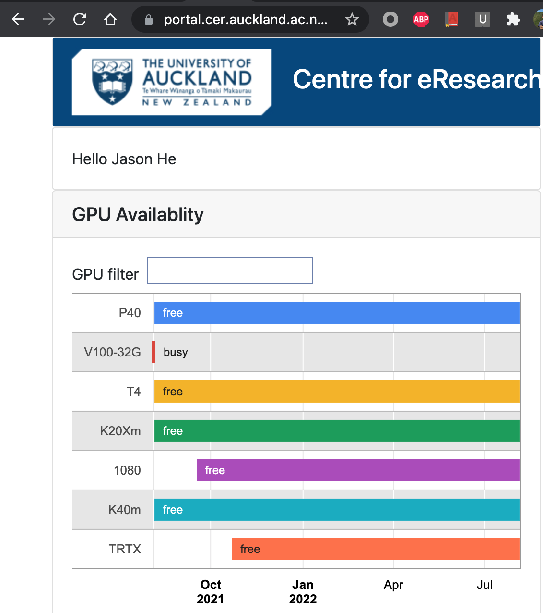
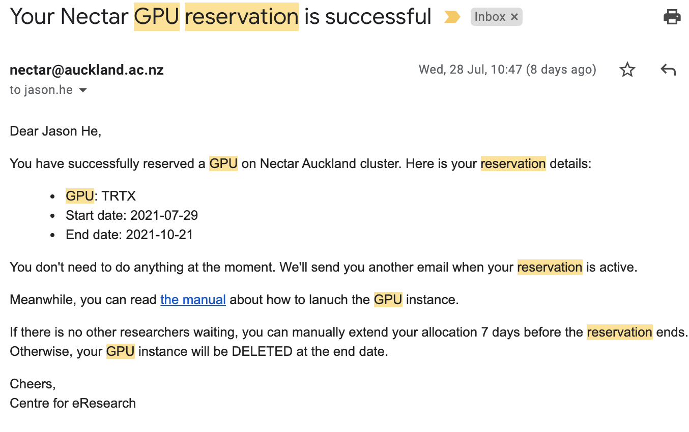
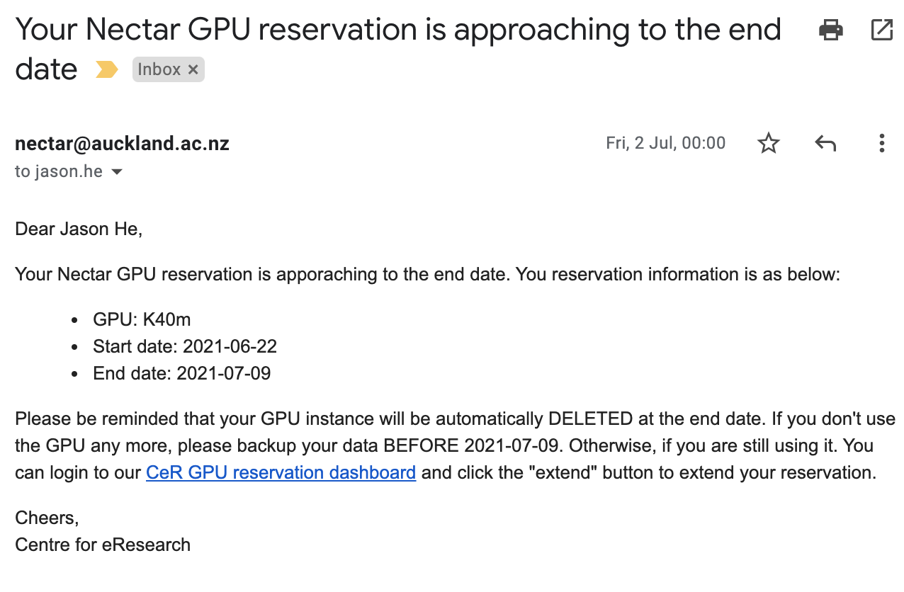

**Note**: GPU is NOT available for all Nectar projects. You have to reserve it first. This article is only applicable for the approved Nectar GPU projects. For more information about GPU and machine learning resources available for UoA researchers, please refer to [Machine Learning Service](https://research-hub.auckland.ac.nz/#/content/28) on Research Hub.

## The GPU reservation system

Before you can launch a GPU instance, you must reserve a GPU first. Login to this website with your university credential

[Centre for eResearch - GPU Reservation](https://portal.cer.auckland.ac.nz/gpu)

, and you'll see the current availability of all GPUs.

{:width="60%"}

Follow the instructions to reserve your GPU instance. If your reservation is successful, you'll receive an email, like this one:  

{:width="60%"}

You can follow the link inside the email to read the instructions on how to launch a GPU instance. 

## Renew your reservation

We your reservation is approaching to the end date (normally 2 weeks before), you'll receive another email asking you to renew. You can follow the instructions to renew your reservation, if nobody has reserved your GPU. You won't be able to see the renew button until you receive the email. That is, you can not renew your reservation in advance.

{:width="60%"}

## GPU reservation v.s. Nectar allocation

There are two separate life cycles: Nectar project allocation lifecycle, and the GPU reservation lifecycle. The nectar project allocation allows you to use nectar services, including VM (without GPU), storage, database, etc. and the GPU reservation allows you to launch a nectar VM with GPU. Since the GPU reservation is built on top of Nectar project allocation, the GPU reservation lifecycle must be within the Nectar project lifecycle.

The nectar project allocation lifecycle is managed via the [Nectar dashboard](https://dashboard.rc.nectar.org.au/), and the GPU reservation lifecycle is managed by the [CeR reservation portal](https://portal.cer.auckland.ac.nz/gpu), In order to use a GPU VM on Nectar, you need both. So firstly you must ensure you have a valid nectar project allocation, and then, you reserve a GPU reservation to enable GPU usage. What you see on CeR reservation portal is the life cycle of your GPU reservation, not your project allocation. If your GPU reservation expires, your GPU VMs will be deleted, but you can still launch normal Nectar VMs, without GPUs. 

