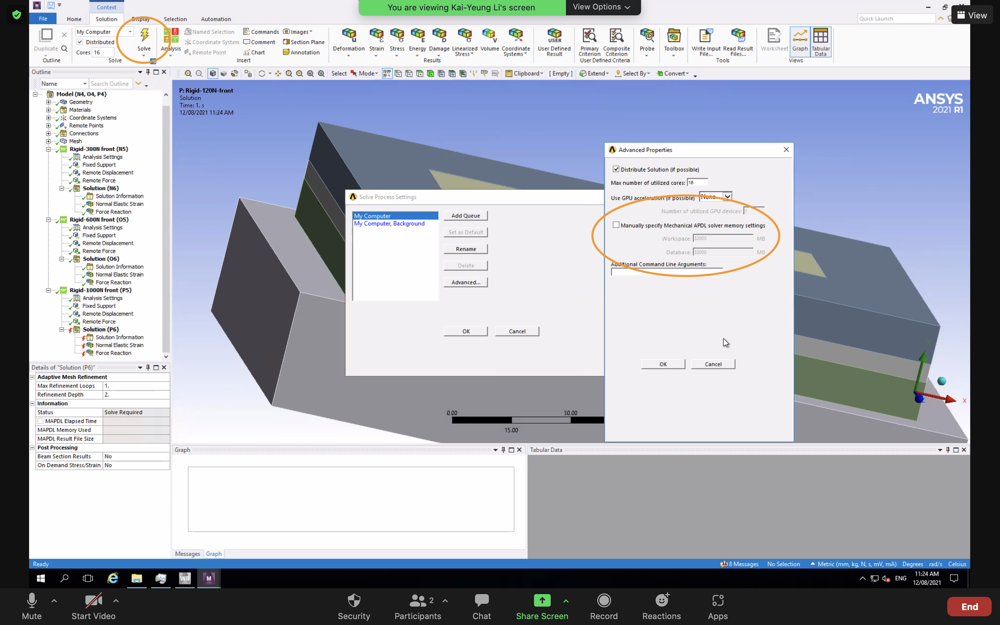

If you encounter issues with ANSYS solvers running out of memory, uncheck this setting to remove the default manual solver memory limit, and allow the system to use disk as virtual memory.

{:width="90%"}

